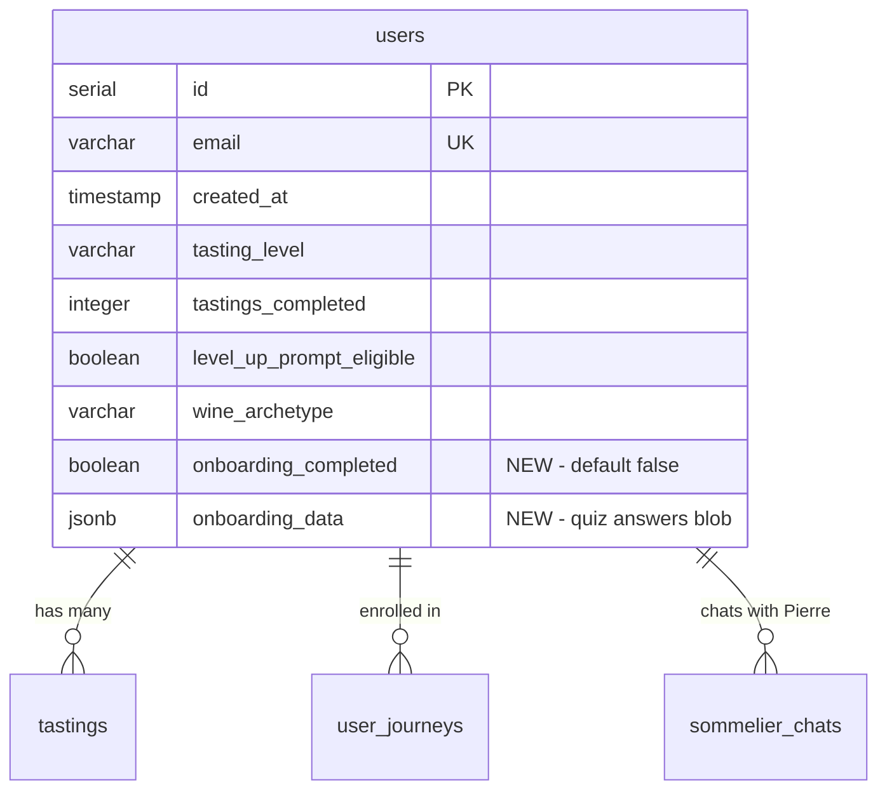

# feat: Hybrid Onboarding Flow

## Overview

New users currently land on an empty home screen with zero guidance. This feature adds a delightful hybrid onboarding: a quick 3-screen interactive quiz captures basic preferences, then Pierre (the AI sommelier) greets them with personalized context and recommends a first journey + bottle.

The goal: **within 60 seconds of signing up, the user feels like the app already knows them.**

## Problem Statement

Today's first-time user experience:
1. User enters email on `/home` login form
2. Server creates account with defaults (`tastingLevel: 'intro'`, `wineArchetype: null`)
3. User sees empty Solo tab — 0 tastings, no active journey, blank preference bars
4. Pierre FAB is visible but has no context to personalize with
5. User has no idea what to do first

This is the classic cold-start problem. The app feels hollow until you've done your first tasting, but there's no guidance toward that first tasting.

## Proposed Solution: Approach C (Hybrid)

```
┌─────────────────────────────────────────────────────────────┐
│  PHASE 1: Quick Quiz (3 screens, ~30 seconds)               │
│                                                              │
│  Screen 1: "How much do you know about wine?"               │
│  Screen 2: "What's your style?"                              │
│  Screen 3: "What do you love to eat?"                        │
│                                                              │
├─────────────────────────────────────────────────────────────┤
│  PHASE 2: Pierre Handoff                                     │
│                                                              │
│  → Save quiz answers to users table                          │
│  → Redirect to /home                                         │
│  → Auto-open Pierre with onboarding context                  │
│  → Pierre greets with personalized welcome + recommends      │
│    first journey + first bottle                              │
└─────────────────────────────────────────────────────────────┘
```

### Why Hybrid?

| Approach | Pro | Con |
|----------|-----|-----|
| A: Pure conversational (Pierre-only) | Magical feel | Hard to extract structured data reliably, longer, users may not engage |
| B: Pure quiz | Fast, structured data clean | Generic app feel, less unique |
| **C: Hybrid (quiz + Pierre)** | **Quick structured capture + magical AI moment** | **Slightly more complex (two UIs)** |

The quiz handles data capture reliably. Pierre handles the magic. Each does what it's best at.

## Technical Approach

### Architecture Diagram

```
┌──────────────────────────────────────────────────────────────────┐
│ FRONTEND                                                          │
│                                                                    │
│  App.tsx                                                           │
│   ├─ Route: /onboarding → <OnboardingQuiz />                     │
│   └─ SommelierFAB (hidden on /onboarding, auto-opens after)      │
│                                                                    │
│  HomeV2.tsx                                                        │
│   └─ After auth: if (!user.onboardingCompleted) redirect          │
│                                                                    │
│  pages/OnboardingQuiz.tsx                                          │
│   ├─ Step 1: KnowledgeLevel                                       │
│   ├─ Step 2: WineVibe                                              │
│   ├─ Step 3: FoodPreferences                                      │
│   └─ Completion: POST /api/user/onboarding → redirect /home       │
│                                                                    │
├──────────────────────────────────────────────────────────────────┤
│ BACKEND                                                            │
│                                                                    │
│  routes/user.ts (NEW)                                              │
│   └─ POST /api/user/onboarding   → save preferences, return user  │
│                                                                    │
│  routes/auth.ts                                                    │
│   └─ GET /api/auth/me  → add onboardingCompleted to response      │
│                                                                    │
│  services/sommelierContextBuilder.ts                               │
│   └─ buildUserContext() → add onboarding profile section           │
│                                                                    │
├──────────────────────────────────────────────────────────────────┤
│ DATABASE                                                           │
│                                                                    │
│  shared/schema.ts → users table                                    │
│   + onboardingCompleted: boolean (default false)                   │
│   + onboardingData: jsonb (quiz answers blob)                      │
│                                                                    │
└──────────────────────────────────────────────────────────────────┘
```

### Phase 1: Schema + API

#### 1a. Add onboarding fields to `users` table

**File:** `shared/schema.ts:647-659`

Add two columns to the `users` table:

```typescript
// In the users pgTable definition:
onboardingCompleted: boolean("onboarding_completed").default(false).notNull(),
onboardingData: jsonb("onboarding_data"),  // { knowledgeLevel, wineVibe, foodPreferences }
```

**Why `onboardingData` as JSONB instead of separate columns?**
- Quiz questions may evolve (we might add/remove questions)
- JSONB is flexible — no schema migration needed when quiz changes
- Single column to read/write, simpler API
- Pierre's context builder can read the blob directly

**Type definition** (add to schema.ts):

```typescript
export interface OnboardingData {
  knowledgeLevel: 'beginner' | 'casual' | 'enthusiast' | 'nerd';
  wineVibe: 'bold' | 'light' | 'sweet' | 'adventurous';
  foodPreferences: string[];  // ['italian', 'sushi', 'bbq', 'spicy', 'cheese', 'seafood']
  completedAt: string;  // ISO timestamp
}
```

Run `npm run db:push` to sync.

#### 1b. Update `/api/auth/me` response

**File:** `server/routes/auth.ts:246-256`

Add `onboardingCompleted` to the response:

```typescript
return res.json({
  user: {
    id: user.id,
    email: user.email,
    createdAt: user.createdAt,
    tastingLevel: user.tastingLevel,
    tastingsCompleted: user.tastingsCompleted,
    levelUpPromptEligible: user.levelUpPromptEligible,
    onboardingCompleted: user.onboardingCompleted,  // ADD THIS
  }
});
```

#### 1c. Create onboarding save endpoint

**New file:** `server/routes/user.ts`

```typescript
import { Express, Request, Response } from "express";
import { requireAuth } from "./auth";
import { db } from "../db";
import { users } from "@shared/schema";
import { eq } from "drizzle-orm";
import { z } from "zod";

const onboardingSchema = z.object({
  knowledgeLevel: z.enum(['beginner', 'casual', 'enthusiast', 'nerd']),
  wineVibe: z.enum(['bold', 'light', 'sweet', 'adventurous']),
  foodPreferences: z.array(z.string()).min(1).max(10),
});

export function registerUserRoutes(app: Express): void {
  app.post("/api/user/onboarding", requireAuth, async (req: Request, res: Response) => {
    const userId = req.session.userId!;

    const parsed = onboardingSchema.safeParse(req.body);
    if (!parsed.success) {
      return res.status(400).json({ error: "Invalid onboarding data", details: parsed.error.flatten() });
    }

    const { knowledgeLevel, wineVibe, foodPreferences } = parsed.data;

    // Map quiz answers to tastingLevel
    const tastingLevelMap: Record<string, string> = {
      beginner: 'intro',
      casual: 'intro',
      enthusiast: 'intermediate',
      nerd: 'advanced',
    };

    await db.update(users).set({
      onboardingCompleted: true,
      onboardingData: {
        knowledgeLevel,
        wineVibe,
        foodPreferences,
        completedAt: new Date().toISOString(),
      },
      tastingLevel: tastingLevelMap[knowledgeLevel],
    }).where(eq(users.id, userId));

    // Return updated user
    const updatedUser = await db.query.users.findFirst({
      where: eq(users.id, userId),
    });

    return res.json({ user: updatedUser });
  });
}
```

Register in `server/routes.ts` alongside other route registrations.

### Phase 2: Onboarding Quiz UI

**New file:** `client/src/pages/OnboardingQuiz.tsx`

#### Quiz Screen Design

Each screen is a full-page dark UI with large tappable cards. No text inputs — everything is tap-to-select. Animated transitions between screens with `AnimatePresence`.

**Screen 1: Knowledge Level**
```
┌──────────────────────────────────┐
│                                   │
│   🍷  Let's get to know you      │
│                                   │
│   How much do you know            │
│   about wine?                     │
│                                   │
│  ┌─────────────────────────────┐  │
│  │  🌱  I'm brand new          │  │
│  │  Never really explored wine  │  │
│  └─────────────────────────────┘  │
│  ┌─────────────────────────────┐  │
│  │  🍷  I know what I like     │  │
│  │  I have favorites but        │  │
│  │  couldn't tell you why       │  │
│  └─────────────────────────────┘  │
│  ┌─────────────────────────────┐  │
│  │  📚  Getting into it         │  │
│  │  I read labels and ask       │  │
│  │  questions at wine shops     │  │
│  └─────────────────────────────┘  │
│  ┌─────────────────────────────┐  │
│  │  🧠  Full wine nerd          │  │
│  │  I could talk terroir        │  │
│  │  all day                     │  │
│  └─────────────────────────────┘  │
│                                   │
│  ───────── Skip for now ──────── │
│                                   │
└──────────────────────────────────┘
```

**Screen 2: Wine Vibe**
```
┌──────────────────────────────────┐
│  ← Back              2 of 3      │
│                                   │
│   What's your style?              │
│   Pick what sounds most like you  │
│                                   │
│  ┌─────────────────────────────┐  │
│  │  🔥  Bold & Intense         │  │
│  │  Big reds, full body, wow   │  │
│  └─────────────────────────────┘  │
│  ┌─────────────────────────────┐  │
│  │  🌸  Light & Fresh          │  │
│  │  Crisp whites, delicate     │  │
│  │  rosés, easy-drinking       │  │
│  └─────────────────────────────┘  │
│  ┌─────────────────────────────┐  │
│  │  🍯  Sweet & Fruity         │  │
│  │  Moscato, Riesling, dessert │  │
│  │  wines, fruit-forward       │  │
│  └─────────────────────────────┘  │
│  ┌─────────────────────────────┐  │
│  │  🎲  Surprise me            │  │
│  │  I'll try anything once     │  │
│  └─────────────────────────────┘  │
│                                   │
│  ───────── Skip for now ──────── │
│                                   │
└──────────────────────────────────┘
```

**Screen 3: Food Preferences (multi-select)**
```
┌──────────────────────────────────┐
│  ← Back              3 of 3      │
│                                   │
│   What do you love to eat?        │
│   Pick all that apply             │
│                                   │
│  ┌────────┐  ┌────────┐          │
│  │ 🍝     │  │ 🍣     │          │
│  │Italian │  │ Sushi  │          │
│  └────────┘  └────────┘          │
│  ┌────────┐  ┌────────┐          │
│  │ 🔥     │  │ 🧀     │          │
│  │ BBQ    │  │Cheese  │          │
│  └────────┘  └────────┘          │
│  ┌────────┐  ┌────────┐          │
│  │ 🌶️     │  │ 🦐     │          │
│  │ Spicy  │  │Seafood │          │
│  └────────┘  └────────┘          │
│  ┌────────┐  ┌────────┐          │
│  │ 🥩     │  │ 🥗     │          │
│  │ Steak  │  │ Veggie │          │
│  └────────┘  └────────┘          │
│                                   │
│  ┌─────────────────────────────┐  │
│  │  Let's go! →                 │  │
│  └─────────────────────────────┘  │
│                                   │
│  ───────── Skip for now ──────── │
│                                   │
└──────────────────────────────────┘
```

#### Quiz Component Pattern

Use the established multi-step view state pattern from `SoloTastingNew.tsx:61`:

```typescript
type QuizStep = 'knowledge' | 'vibe' | 'food';

export default function OnboardingQuiz() {
  const [step, setStep] = useState<QuizStep>('knowledge');
  const [answers, setAnswers] = useState({
    knowledgeLevel: null as string | null,
    wineVibe: null as string | null,
    foodPreferences: [] as string[],
  });
  const [, setLocation] = useLocation();
  const queryClient = useQueryClient();

  const saveMutation = useMutation({
    mutationFn: async (data: typeof answers) => {
      const res = await apiRequest("POST", "/api/user/onboarding", data);
      if (!res.ok) throw new Error("Failed to save");
      return res.json();
    },
    onSuccess: () => {
      queryClient.invalidateQueries({ queryKey: ["/api/auth/me"] });
      setLocation("/home?pierre=welcome");
    },
    onError: (error) => {
      // Show error toast, don't fake success (learnings from past bugs)
    },
  });

  const handleSkip = () => {
    // Skip saves onboardingCompleted=true with null data
    // so user isn't asked again
    saveMutation.mutate({
      knowledgeLevel: null,
      wineVibe: null,
      foodPreferences: [],
    });
  };

  // AnimatePresence wraps each step with slide transitions
  return (
    <div className="min-h-screen bg-gradient-primary">
      <AnimatePresence mode="wait">
        {step === 'knowledge' && <KnowledgeStep ... />}
        {step === 'vibe' && <VibeStep ... />}
        {step === 'food' && <FoodStep ... />}
      </AnimatePresence>
    </div>
  );
}
```

**Animation pattern** (slide left/right with Framer Motion):
```typescript
const slideVariants = {
  enter: (direction: number) => ({
    x: direction > 0 ? 300 : -300,
    opacity: 0,
  }),
  center: { x: 0, opacity: 1 },
  exit: (direction: number) => ({
    x: direction < 0 ? 300 : -300,
    opacity: 0,
  }),
};
```

### Phase 3: First-Time User Detection + Routing

#### 3a. Redirect logic in HomeV2

**File:** `client/src/pages/HomeV2.tsx:192-228`

After auth check resolves, redirect new users:

```typescript
const isAuthenticated = !!authData?.user;
const user = authData?.user;

// Redirect new users to onboarding
useEffect(() => {
  if (user && !user.onboardingCompleted) {
    setLocation("/onboarding");
  }
}, [user, setLocation]);
```

#### 3b. Register onboarding route

**File:** `client/src/App.tsx`

```typescript
// Add to lazy imports
const OnboardingQuiz = lazy(() => import("@/pages/OnboardingQuiz"));

// Add route (before /home route)
<Route path="/onboarding" component={OnboardingQuiz} />
```

#### 3c. Hide Pierre FAB during onboarding

**File:** `client/src/components/sommelier/SommelierFAB.tsx:9`

Add `/onboarding` to hidden routes:

```typescript
const HIDDEN_ROUTE_PATTERNS = [
  /^\/onboarding$/,  // ADD THIS
  /^\/tasting\/[^/]+\/[^/]+$/,
  /^\/tasting\/new$/,
  /^\/solo\/new$/,
  /^\/completion\//,
  /^\/host\//,
];
```

#### 3d. Guard against re-visiting /onboarding

In `OnboardingQuiz.tsx`, if user has already completed onboarding, redirect to home:

```typescript
const { data: authData } = useQuery<{ user: User }>({
  queryKey: ["/api/auth/me"],
  // ...
});

useEffect(() => {
  if (authData?.user?.onboardingCompleted) {
    setLocation("/home");
  }
}, [authData]);
```

### Phase 4: Pierre Context Enrichment

#### 4a. Enrich system prompt with onboarding data

**File:** `server/services/sommelierContextBuilder.ts:52-92`

In `buildUserContext()`, after the existing `wineArchetype` line:

```typescript
// Onboarding profile (if completed)
if (user.onboardingData) {
  const ob = user.onboardingData as OnboardingData;
  const vibeMap: Record<string, string> = {
    bold: "bold, full-bodied wines",
    light: "light, crisp wines",
    sweet: "sweet, fruit-forward wines",
    adventurous: "trying new and unusual wines",
  };
  const knowledgeMap: Record<string, string> = {
    beginner: "brand new to wine",
    casual: "drinks wine casually, knows what they like",
    enthusiast: "actively learning about wine",
    nerd: "serious wine knowledge",
  };
  lines.push(`Self-described: ${knowledgeMap[ob.knowledgeLevel] || ob.knowledgeLevel}`);
  lines.push(`Style preference: ${vibeMap[ob.wineVibe] || ob.wineVibe}`);
  if (ob.foodPreferences?.length > 0) {
    lines.push(`Favorite foods: ${ob.foodPreferences.join(", ")}`);
  }
}
```

This means Pierre will **automatically** have onboarding context from the very first chat, with zero additional API work.

#### 4b. Pierre auto-open with welcome message

**File:** `client/src/components/sommelier/SommelierFAB.tsx`

Detect `?pierre=welcome` query param and auto-open:

```typescript
export function SommelierFAB() {
  const [isOpen, setIsOpen] = useState(false);
  const [location] = useLocation();

  // Auto-open Pierre after onboarding
  useEffect(() => {
    if (location.includes("pierre=welcome")) {
      // Small delay so home page renders first
      const timer = setTimeout(() => setIsOpen(true), 500);
      return () => clearTimeout(timer);
    }
  }, [location]);

  // ... rest unchanged
}
```

When Pierre opens after onboarding, the `WelcomeState` component in `SommelierChatSheet` will show. The user can then type anything or use a suggested prompt, and Pierre will already have their onboarding context in the system prompt.

**Alternative (nicer UX):** Pre-populate Pierre with a first message that references the quiz. This requires the frontend to auto-send a message like "I just finished the onboarding quiz — what should I try first?" when `?pierre=welcome` is detected. The `useSommelierChat` hook's `sendMessage` function can handle this.

### Phase 5: Handle Existing Users (Migration)

Users who signed up before onboarding was built will have `onboardingCompleted: false` by default.

**Decision:** Existing users should NOT be forced into onboarding if they already have tasting history.

Add to the redirect logic in `HomeV2.tsx`:

```typescript
useEffect(() => {
  if (user && !user.onboardingCompleted && user.tastingsCompleted === 0) {
    setLocation("/onboarding");
  }
}, [user, setLocation]);
```

This means: only redirect to onboarding if the user has **never** completed a tasting. Users who signed up before and already have history skip straight to home.

## Edge Cases & Mitigations

| Edge Case | Mitigation |
|-----------|------------|
| **Browser closed mid-quiz** | Quiz state is local React state (not persisted). User returns to /home, gets redirected back to /onboarding, starts fresh. Quiz is ~30 seconds so restart is acceptable. |
| **User completes onboarding, navigates back to /onboarding** | Guard check: if `onboardingCompleted === true`, redirect to /home. |
| **Pierre API fails on handoff** | Pierre handles this already — `SommelierChatSheet` has error/retry states. User still lands on home with quiz data saved; they can open Pierre whenever. |
| **No journeys match user preferences** | Pierre falls back to recommending the most popular beginner journey. The static recommendation tables + GPT fallback in `wineRecommendations.ts` handle this. |
| **Existing users (pre-onboarding)** | Only redirect if `tastingsCompleted === 0`. Users with history skip onboarding. |
| **User changes preferences later** | v1: No UI for re-doing quiz. Pierre learns from actual tasting data over time, which supersedes quiz answers. Onboarding data is the "cold start" signal only. |
| **Skip flow** | Saves `onboardingCompleted: true` with no data. User is never asked again. Pierre has no onboarding context but that's fine — same as today. |
| **User is on desktop** | Same quiz but rendered in a wider layout. No changes needed — Tailwind responsive classes handle this (`max-w-md mx-auto` centers the quiz on desktop). |
| **Network error during save** | Show error toast + retry button (learned from past silent-data-loss bugs). Don't redirect until save succeeds. |
| **Multiple tabs** | TanStack Query's `staleTime` handles this — all tabs share the `/api/auth/me` cache. Once one tab saves onboarding, the other detects the change on next refetch. |

## Acceptance Criteria

### Functional Requirements
- [x] New users (0 tastings) are redirected to `/onboarding` after login
- [x] Quiz has 3 screens: knowledge level, wine vibe, food preferences
- [x] Each screen has clear, tappable options (no text input required)
- [x] Back navigation works between quiz screens
- [x] "Skip for now" is available on every screen, saves and completes without data
- [x] Quiz answers are saved to database on completion
- [x] User is redirected to `/home` after completion
- [x] Pierre auto-opens on `/home` after onboarding
- [x] Pierre's system prompt includes onboarding data
- [x] Existing users with tasting history skip onboarding
- [x] Completing onboarding prevents re-visiting `/onboarding`
- [x] Pierre FAB is hidden during onboarding

### Non-Functional Requirements
- [ ] Quiz loads in < 1 second (lazy-loaded, no API calls until save)
- [ ] Animations are smooth (60fps) on mobile
- [ ] Accessible: keyboard navigation works, screen reader labels present
- [ ] Save mutation includes proper error handling with retry

### Quality Gates
- [ ] Manual test: new user signup → quiz → Pierre greeting flow works end-to-end
- [ ] Manual test: existing user with tastings → skips onboarding
- [ ] Manual test: skip flow → saves correctly, doesn't loop
- [ ] Manual test: mobile Safari + Chrome
- [x] `npm run check` passes (TypeScript)

## Implementation Phases

### Phase 1: Schema + API (~30 min)
1. Add `onboardingCompleted` + `onboardingData` to `users` in `shared/schema.ts`
2. Run `npm run db:push`
3. Update `/api/auth/me` to return `onboardingCompleted`
4. Create `POST /api/user/onboarding` in new `server/routes/user.ts`
5. Register routes in `server/routes.ts`

### Phase 2: Quiz UI (~1-2 hours)
1. Create `client/src/pages/OnboardingQuiz.tsx` with 3 quiz steps
2. Build step components: `KnowledgeStep`, `VibeStep`, `FoodStep`
3. Add animated transitions between steps
4. Add skip flow
5. Wire up save mutation
6. Add `/onboarding` route to `App.tsx`

### Phase 3: Routing + Detection (~30 min)
1. Add redirect logic to `HomeV2.tsx` (check `onboardingCompleted` + `tastingsCompleted`)
2. Add `/onboarding` to `HIDDEN_ROUTE_PATTERNS` in `SommelierFAB.tsx`
3. Add guard in `OnboardingQuiz.tsx` to redirect if already completed

### Phase 4: Pierre Integration (~30 min)
1. Enrich `buildUserContext()` in `sommelierContextBuilder.ts` with onboarding data
2. Add `?pierre=welcome` auto-open logic to `SommelierFAB.tsx`
3. Optionally: auto-send first message to Pierre after onboarding

### Phase 5: Polish + Test (~30 min)
1. Mobile testing (Safari, Chrome)
2. Desktop layout verification
3. Edge case testing (skip, back, close-reopen)
4. Haptic feedback on card taps
5. Progress indicator (dots or "1 of 3")

## Files Changed

### New Files
| File | Purpose |
|------|---------|
| `client/src/pages/OnboardingQuiz.tsx` | Quiz page with 3 steps |
| `server/routes/user.ts` | User profile endpoints (onboarding save) |

### Modified Files
| File | Change |
|------|--------|
| `shared/schema.ts` | Add `onboardingCompleted` + `onboardingData` to users table |
| `server/routes/auth.ts:246-256` | Add `onboardingCompleted` to `/api/auth/me` response |
| `server/routes.ts` | Register new user routes |
| `client/src/App.tsx:16,41` | Add lazy import + route for OnboardingQuiz |
| `client/src/pages/HomeV2.tsx:192` | Add redirect logic for first-time users |
| `client/src/components/sommelier/SommelierFAB.tsx:9,56` | Hide on /onboarding + auto-open after |
| `server/services/sommelierContextBuilder.ts:52` | Add onboarding data to Pierre's context |

## ERD Changes



## References

### Internal
- `shared/schema.ts:647-659` — users table definition
- `server/routes/auth.ts:231-261` — `/api/auth/me` endpoint
- `server/services/sommelierContextBuilder.ts:41-97` — Pierre context builder
- `client/src/components/sommelier/SommelierFAB.tsx:1-114` — Pierre FAB component
- `client/src/pages/HomeV2.tsx:174-228` — Auth check + login flow
- `client/src/App.tsx:39-95` — Route registration
- `client/src/pages/SoloTastingNew.tsx:61` — Multi-step view state pattern

### Institutional Learnings Applied
- State preservation: close != reset (from `docs/solutions/ui-bugs/state-loss-accidental-dismiss-pierre-chat-20260215.md`)
- Never fake success on save errors (from `docs/solutions/logic-errors/silent-data-loss-solo-tasting-saves-20260215.md`)
- Always `invalidateQueries` after mutations (from same source)
- Use `handleOnly` on Vaul drawers (from same source)
- Auth consistency via shared `queryKey: ["/api/auth/me"]` (from `docs/solutions/integration-issues/auth-chat-state-sync-race-condition-20260214.md`)
